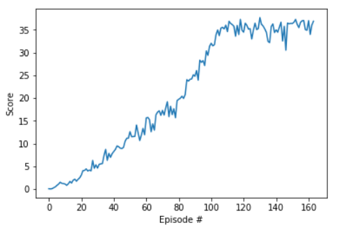

# reacher-continuous-control
Application of Deep Deterministic Policy Gradients (DDPG) to simultaneously control 20 double-jointed arms in a Unity environment.

## The Problem
In this project, we are training reinforcement learning agents with double-jointed arms to follow moving targets in the Unity ML-Agents Reacher environment. A reward of +0.1 is given for each time step that an agent's hand is in the target position. We want to maximize the number of time steps that the agent maintains its position in the target position.

## The Environment
We are using the Reacher environment from the Unity ML-Agents plugin for this task.


For each agent, each state consists of 33 variables corresponding to position, rotation, velocity, and angular velocities of the arm. Each action is a vector with four numbers in the range \[-1, 1\], corresponding to torque applicable to two joints. We simultaneously train 20 identical agents, each with their own copy of the environment. At each episode, we store the average of the scores accumulated by all the agents in a buffer of size 100. The task is considered solved when the average score of the buffer reaches or exceeds 30 over 100 consecutive episodes.

## Running the Code
All code, as well as detailed descriptions of the workflow, are in ```Report.ipynb```. Make sure the file_name for loading the correct UnityEnvironment is appropriate to your machine. Available environments are in the ```envs``` folder in this repository. Alternatively, they are available for download in the links below:
 * Linux: [click here](https://s3-us-west-1.amazonaws.com/udacity-drlnd/P2/Reacher/Reacher_Linux.zip)
 * Mac OSX: [click here](https://s3-us-west-1.amazonaws.com/udacity-drlnd/P2/Reacher/Reacher.app.zip)
 * Windows (32-bit): [click here](https://s3-us-west-1.amazonaws.com/udacity-drlnd/P2/Reacher/Reacher_Windows_x86.zip)
 * Windows (64-bit): [click here](https://s3-us-west-1.amazonaws.com/udacity-drlnd/P2/Reacher/Reacher_Windows_x86_64.zip)
 
The code in ```Report.ipynb``` walks through the implementation of a deep reinforcement learning agent that uses a Deep Deterministic Policy Gradient (DDPG) approach with Actor-Critic network structures to solve the target-following task. To reduce sequential data correlations, a memory replay buffer is used to store environmental interactions and randomly sample minibatches to update the network parameters, and both local and target copies of each network are kept to update at different rates. Action exploration by the agents is regulated through an Ornstein-Uhlenbeck process with decaying variance at each episode.

The environment is solved in 164 episodes, with models saved to ```actor.pth``` and ```critic.pth```. A plot of the learning curve throughout the training process is saved in ```learning_curve.png``` and is also pictured below.

 
